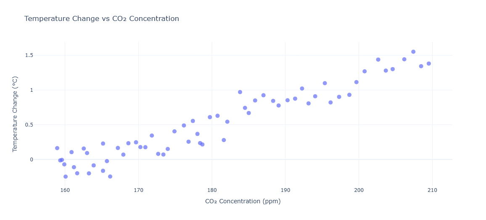
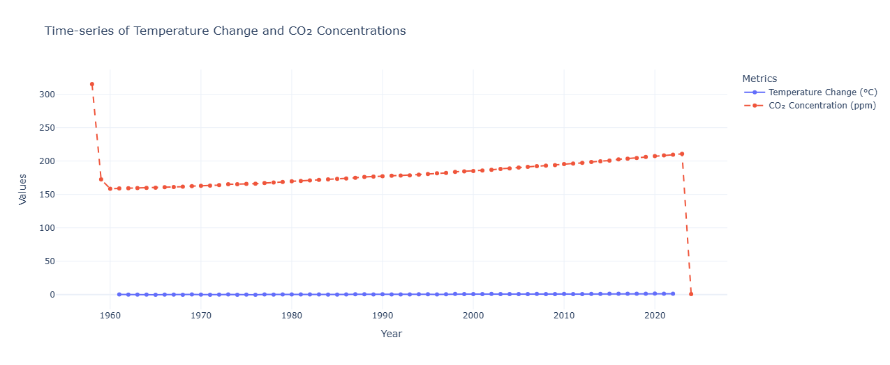

# Carbon Emissions Impact Analysis with Python

## Overview
This project analyzes the impact of carbon dioxide (CO₂) emissions on global temperature anomalies using Python. The goal is to understand how rising CO₂ levels correlate with temperature changes and predict future impacts using statistical and machine learning models. The project also provides insights into emission trends over decades and their environmental consequences.

## Datasets Used
- **Temperature Anomalies Dataset**: Contains annual temperature changes across multiple countries and decades.
- **CO₂ Concentrations Dataset**: Monthly global atmospheric CO₂ levels over time.

## Features
- Data Loading and Preprocessing
- Exploratory Data Analysis (EDA)
- Data Visualization
- Statistical Analysis
- Predictive Modeling

## Installation
To get started with this project, clone the repository and install the required dependencies.

```bash
# Clone the repository
git clone https://github.com/yourusername/carbon-emissions-analysis.git

# Navigate to the project directory
cd carbon-emissions-analysis

# Install dependencies
pip install -r requirements.txt
```

## Usage
Run the main Python script to perform the analysis:

```bash
python analysis.py
```

This will process the data, generate visualizations, and display insights into carbon emissions and their impact on temperature anomalies.

## Results & Insights





- **Strong Correlation**: The analysis confirms a strong correlation between CO₂ levels and global temperature rise.
- **Emission Trends**: Visualizations highlight the increasing trend of CO₂ emissions over time.
- **Predictive Modeling**: Forecasting models help predict future CO₂ concentrations and their potential impact on climate change.
- **Environmental Impact**: The project emphasizes the urgency of addressing climate change through emission reduction and policy interventions.

## Contributing
Contributions are welcome! If you have any improvements or suggestions:
1. Fork the repository
2. Create a new branch (`feature-branch`)
3. Commit your changes
4. Push to your branch and submit a pull request
